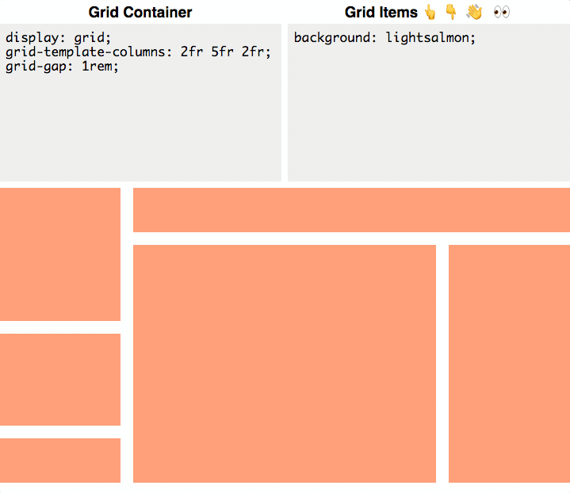

# CSS Grid Playground [](https://github.com/itsjavi/css-grid-playground/actions/workflows/quality.yml)

**CSS Grid Playground** lets you visually play with the [CSS Grid Layout](https://www.w3.org/TR/css3-grid-layout/)
elements in the browser to quickly sketch up a layout for your site.

The layout, which provides a basic way of editing a container and its direct children, renders changes instantly as you
update the corresponding CSS giving you instant feedback.



## Tech Stack

- Bun as a JS runtime, bundler and package manager
- [Vite + React.js + SWC](https://github.com/vitejs/vite-plugin-react-swc)
- CSS Grid Layouts
- SCSS Modules
- OpenProps for CSS variables
- Zustand for state management
- URL hash to persist state
- Github Actions as CI/CD
- Github Pages for deployments

SVG Icons are from lucide.dev

## Getting Started

First, you will need [Bun](https://bun.sh/) 1.0.20 or higher installed on your machine. Then, you can run the following
commands after cloning this repository, to get started:

```bash
bun install
bun run dev
```

## Background

This project is more than a fork, but actually a total rewrite inspired in "CSS Grid Playground", the original work from
[@purplecones](https://github.com/purplecones/css-grid-playground).

This version aims to provide better maintainability with a more modern codebase, and also a richer user experience while
keeping its simplicity.
